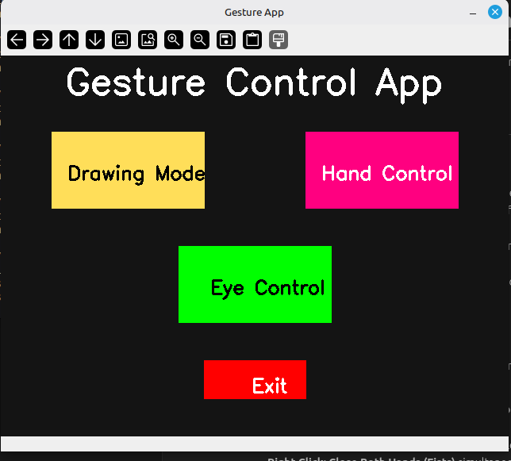
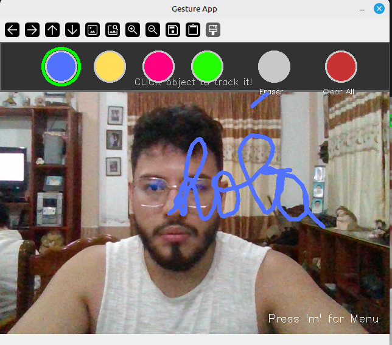
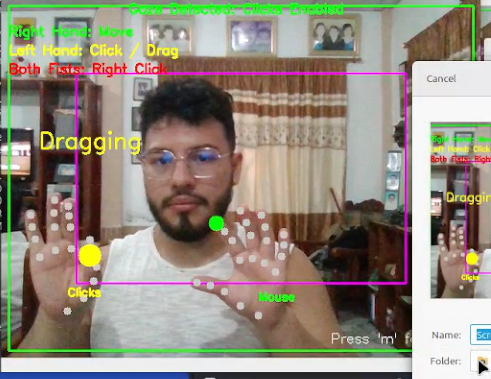
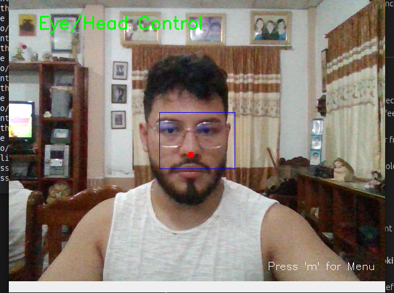

# Gesture Control & Virtual Drawing

A Python application that combines virtual drawing with advanced hand and eye gesture control. Use your webcam to draw in the air or control your mouse cursor!

## Demo

<p align="center">
  
</p>

## Features

<p align="center">
  
</p>

### 🎨 Drawing Mode (Virtual Whiteboard)
<p align="center">
  
</p>

- **Virtual Canvas**: Draw on the screen using a colored object (e.g., a blue marker cap).
- **Dynamic Calibration**: **Click on any object** in the video feed to set it as the tracking target!
- **Toolbar UI**:
    - **Colors**: Select Blue, Yellow, Pink, Green, or Eraser from the top menu.
    - **Clear Screen**: Button to wipe the canvas.
    - **Visual Feedback**: Shows the currently selected color and cursor position.

### ✋ Hand Control Mode (Mouse)
<p align="center">
  
</p>

- **Mirror Mode**: Designed for webcam usage.
    - **Right Hand (Physical)**: Controls Mouse Movement (Smoothed).
    - **Left Hand (Physical)**: Controls Actions (Clicks).
- **Gaze Safety**: Clicks are **only enabled when you are looking at the screen**. If you look away, clicks are disabled to prevent accidents.
- **Gestures**:
    - **Left Click / Drag**: Pinch Index + Thumb on your Left Hand.
    - **Right Click**: **Close Both Hands (Fists)** simultaneously and hold for 0.5s.
- **Full Screen Reach**: Uses a "frame margin" to allow reaching screen corners comfortably.

### 👁️ Eye Control Mode
<p align="center">
  
</p>

- **Head Pose Tracking**: Controls the mouse cursor using your head orientation (nose tip tracking).
- **Hands-Free**: Useful for accessible computing or when hands are occupied.

## Installation

1.  Clone the repository.
2.  Install the required packages:

    ```bash
    pip install opencv-python numpy mediapipe pyautogui
    ```
    *Note: If using `uv`, you can run directly with `uv run main.py`.*

## Models

The application uses MediaPipe models (`hand_landmarker.task`, `face_landmarker.task`).
- These are automatically downloaded to the `models/` directory on first run.

## Usage

Run the main script:

```bash
python main.py
```
*(Or `uv run main.py`)*

### Controls

- **Menu**: Starts in the main menu. Click buttons to select modes.
- **Switch Modes**: Press `m` to return to the **Menu** from any mode.
- **Exit**: Press `ESC` to quit the application.

### Configuration
- **Models**: Located in `models/`.
- **Source**: `main.py` is the entry point. Modules are in `modules/`.
